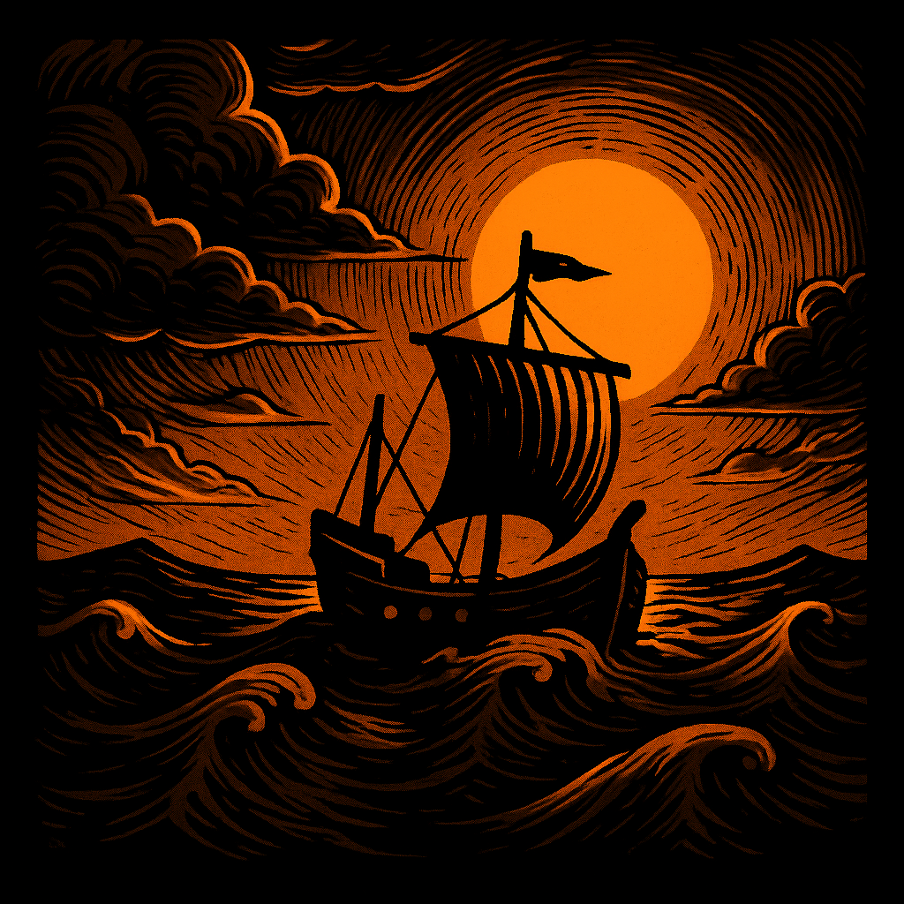
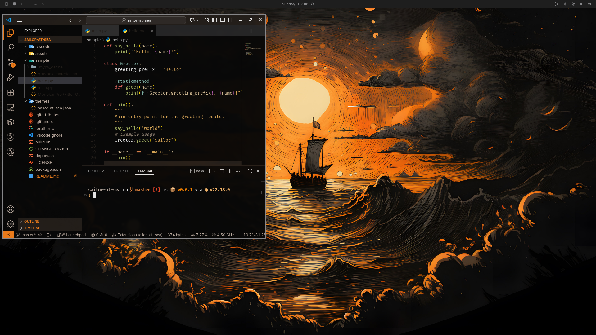
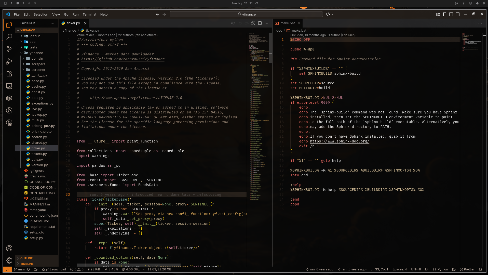
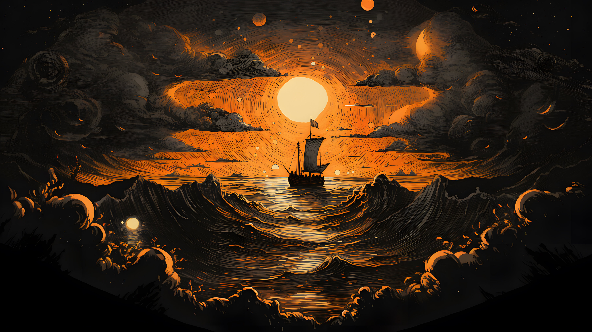

  

<h1 align="center">Sailor At Sea</h1>

  <b>A high power, high contrast theme for VS Code </b>

  <a href="#about">About</a> • <a href="#features">Features</a>

  
  

---

  

  

## About

Sailor At Sea is a high contrast theme for Visual Studio Code, designed to provide a powerful look while ensuring maximum readability. With its dark, matte black background and vibrant syntax highlighting, this theme is perfect for developers who want to reduce eye strain during long coding sessions.

## Features

- **High Contrast**: Designed for maximum readability with a dark, matte black background.
- **Vibrant Syntax Highlighting**: Makes your code pop with clear, distinct colors.
- **Optimized for Focus**: Reduces eye strain during long coding sessions.

## Installation

1. Press extensions icon in your editor.
2. Search for `rikkarth.ship-at-sea`.
3. Select this extension and press install button.

## Credits and Inspiration

- The wallpaper is sourced from Omarchy's [official repository](https://github.com/basecamp/omarchy) under MIT License. It was what inspired the theme's name and aesthetic.
- The rich syntax highlighting is inspired by [sainnhe's Gruvbox Dark Hard Flat](https://github.com/sainnhe/gruvbox-material-vscode) which almost perfectly aligned with the aesthetic I was aiming for.
- The high contrast and matte black background is inspired by [tahayvr's matteblack.nvim](https://github.com/tahayvr/matteblack.nvim) theme for Neovim.

## Wallpaper

Download the wallpaper [here](assets/0-ship-at-sea.jpg).

---

  <i>Happy coding!</i>

